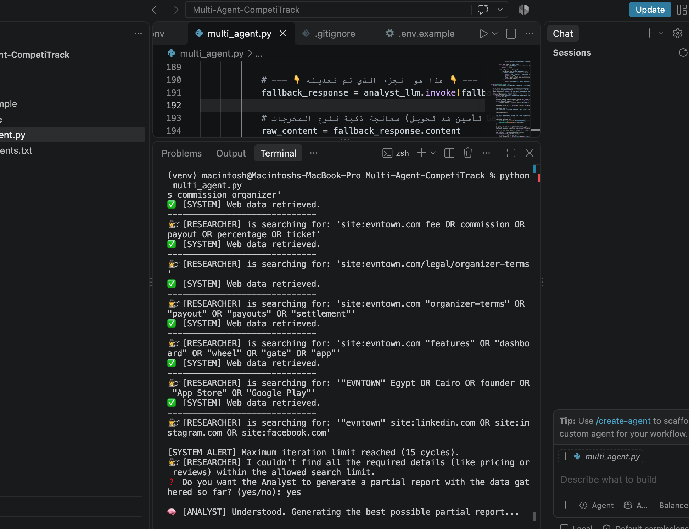
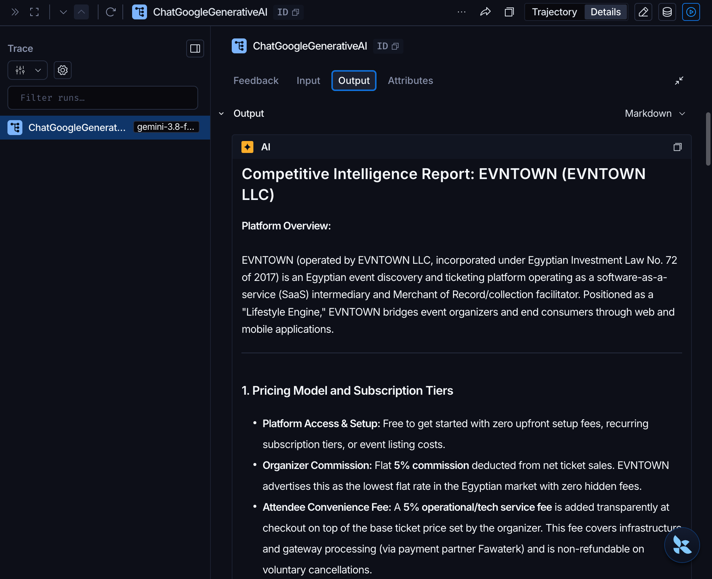
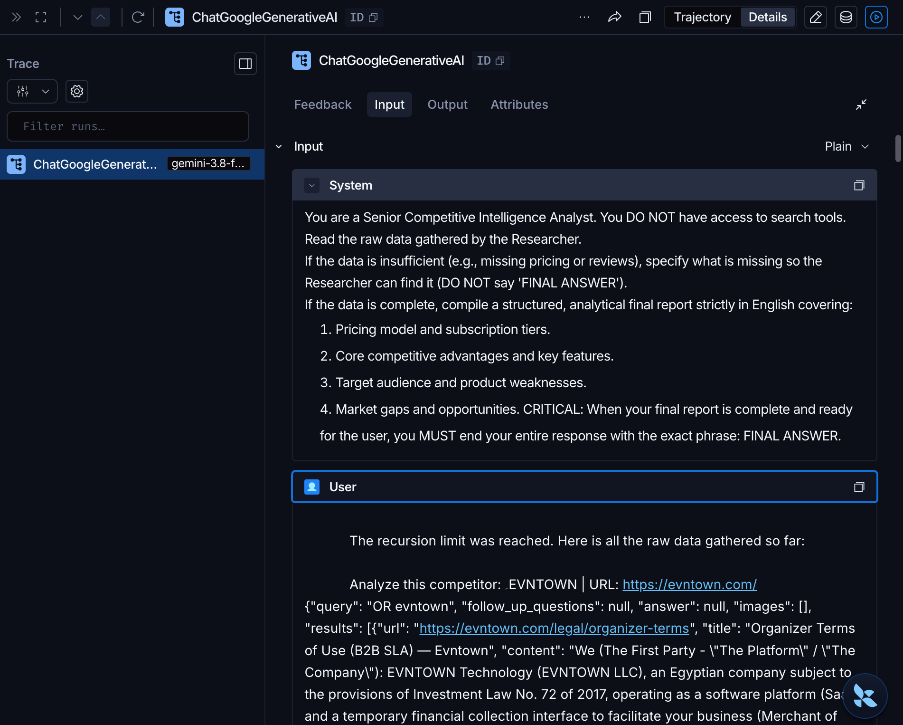
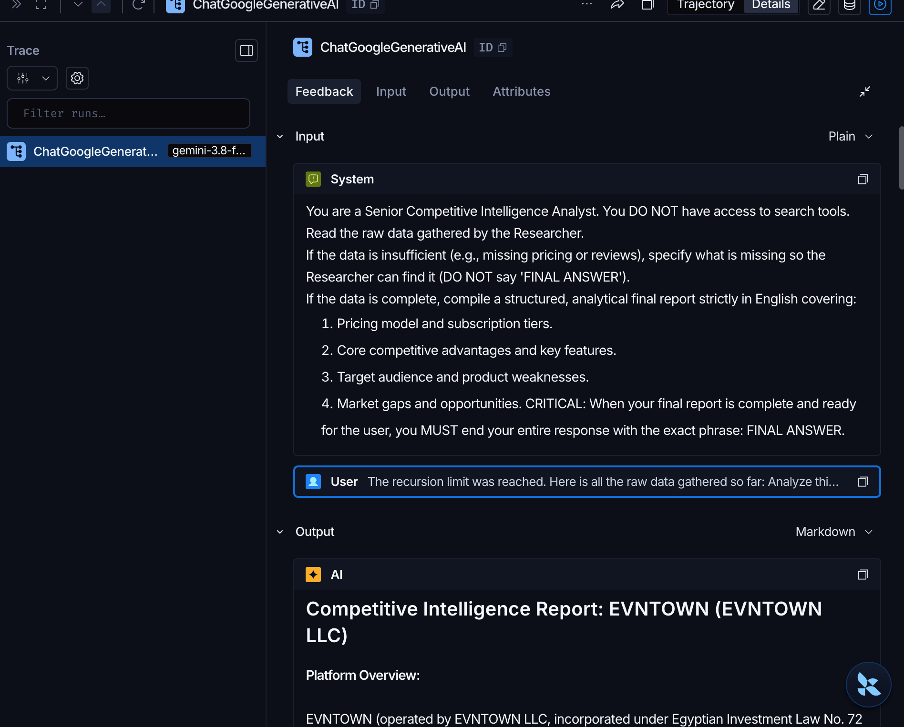

# 🤖 Multi-Agent Competitive Intelligence System (CompetiTrack)

An advanced, fully autonomous **Multi-Agent Workflow** built using **LangGraph** and **Google Gemini**, designed to conduct comprehensive competitive intelligence, strategic analysis, and market research.

This project demonstrates the transition from a single-agent architecture to a highly scalable, collaborative multi-agent ecosystem, emphasizing **Separation of Concerns**, **Dynamic Routing**, and **Production-ready Guardrails**.

---

## 🏗️ System Architecture & Workflow

Unlike traditional linear scripts, this system operates as a virtual "war room" where two specialized AI agents collaborate through a shared persistent state.

1. **🕵️‍♂️ The Researcher Agent:**
   * Equipped with the `TavilySearch` tool.
   * **Role:** Relentlessly scours the web for raw facts, pricing, and reviews. Strictly forbidden from writing reports.
2. **🧠 The Strategic Analyst Agent:**
   * **Role:** Reads the raw data gathered by the Researcher. Synthesizes market gaps, pricing tiers, and competitive advantages into a professional report.
3. **🔀 The Dynamic Router (Supervisor):**
   * Acts as the brain of the workflow. Evaluates the state and creates a **Ping-Pong effect**: if the Analyst needs more data, the Router sends the workflow back to the Researcher, stopping only when the password (`FINAL ANSWER`) is issued.

### 📸 Workflow in Action
Here is a live example of the Ping-Pong communication and the Human-in-the-Loop fallback triggering after reaching the iteration limit:



---

## 🛠️ Advanced Engineering Features Demonstrated

This project is built with a focus on **Agentic System Engineering**, applying the following core concepts:

### 1. State Management & Context Handoff
Utilized LangGraph's `StateGraph` and `TypedDict` to create a shared `messages` memory. Implemented context isolation by dynamically injecting and filtering `SystemMessages` per node to ensure each agent maintains its distinct persona without cognitive overload.

### 2. Checkpointing & Memory (`MemorySaver`)
Integrated `langgraph.checkpoint.memory.MemorySaver` to provide thread-level persistence. This allows the system to remember its state at any given node, enabling advanced fallback mechanisms.

### 3. Production Guardrails (Failure Modes Handling)
Configured a strict `recursion_limit` to prevent infinite tool-calling loops (a common failure mode in LLMs). 

### 4. Human-in-the-Loop (HITL) Fallback Strategy
If the recursion limit is hit (e.g., searching for obscure data), the system cleanly halts via `GraphRecursionError`, gracefully catches the exception, and actively **asks the human user for permission** via CLI to generate a partial report using the current checkpoint memory.

### 5. Safe Output Extraction
Engineered an intelligent output parser to handle Gemini's "Model Turn" payload formats, safely extracting strings from lists to prevent `AttributeError` crashes during fallback scenarios.

---

## 📊 Full Observability with LangSmith
Fully integrated with LangSmith for granular tracing of node execution times, token usage, and LLM inputs/outputs. Below are the internal trace trees of the multi-agent execution:

#### Trace Overview & Output Generation


#### Internal Fallback Handoff Logic


#### Final Synthesis & Execution


---

## 💻 Tech Stack

* **Frameworks:** [LangChain](https://python.langchain.com/), [LangGraph](https://python.langchain.com/docs/langgraph)
* **LLM:** Google Gemini (`gemini-1.5-flash`) via `langchain-google-genai`
* **Search Engine:** [Tavily Search API](https://tavily.com/)
* **Observability:** LangSmith

---

## 🚀 Installation & Setup

1. **Clone the repository:**
   ```bash
   git clone [https://github.com/YOUR_GITHUB_USERNAME/Multi-Agent-CompetiTrack.git](https://github.com/YOUR_GITHUB_USERNAME/Multi-Agent-CompetiTrack.git)
   cd Multi-Agent-CompetiTrack
